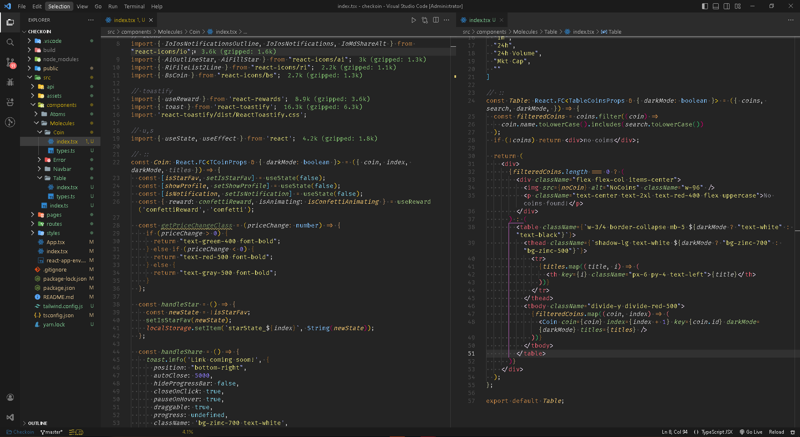

# coelhiN Theme (VS Code)

Boost your productivity and level up your coding experience with a theme that reflects your unique style. Get ready to customize your coding environment and make it truly yours.

[Download](https://marketplace.visualstudio.com/items?itemName=coelhiN.coelhiN-theme) now and embark on a journey of coding bliss with our personalized theme.

## Screenshot
**◦ coelhiN Smooth**

**◦ coelhiN Dark**

## 🚀 Installation Theme

1. Open the Extensions sidebar in VS Code
2. Search for `coelhiN Theme`
3. Click Install
4. Open the Command Palette with Ctrl+Shift+P or ⇧⌘P
5. Select Preferences: Color Theme and choose `coelhiN Theme`.

##
**Enjoy! ♡**